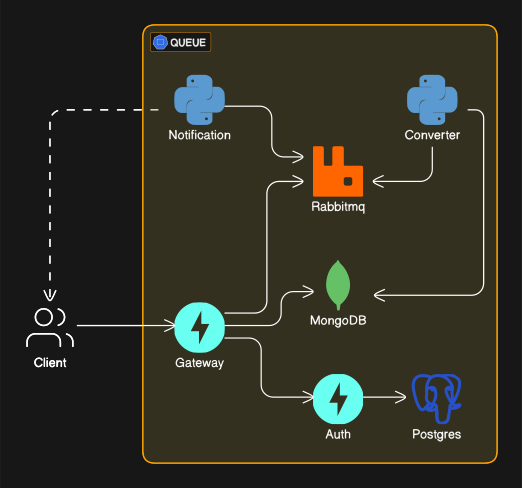
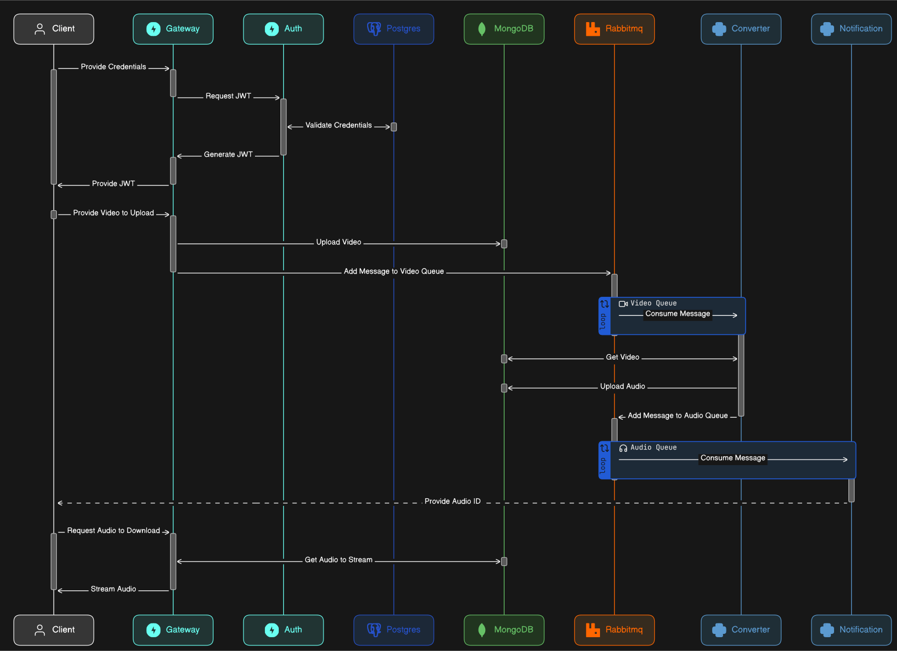
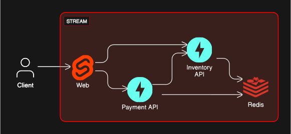
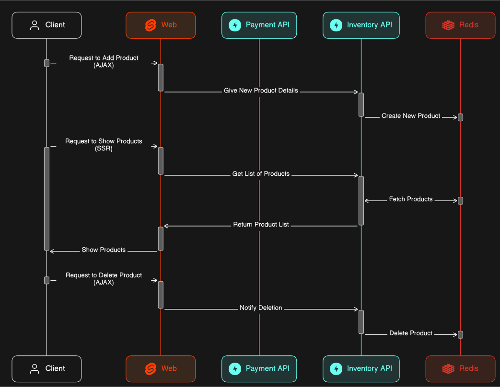
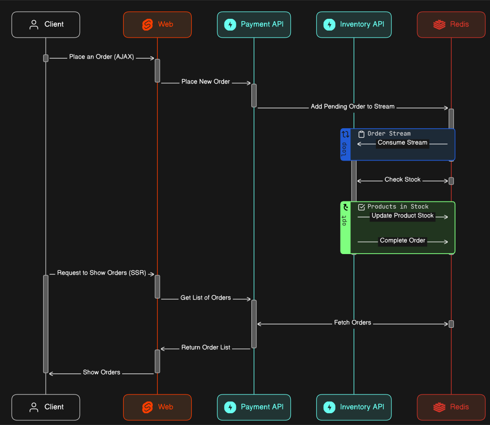
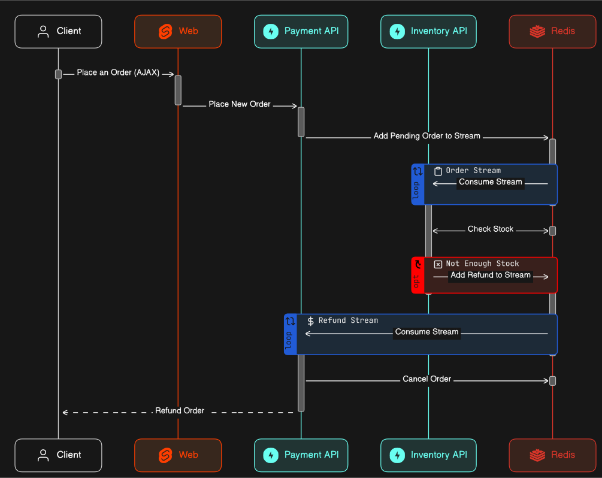

# Microservices Repos

This repository demonstrates different techniques for handling user requests asynchronously using microservices. The services included here can be deployed using either Docker or Kubernetes, offering flexibility and adaptability depending on your chosen environment.
Prior to deployment, ensure that you construct the necessary images for every local service repository by executing `docker compose build` or utilizing the supplied scripts if working with Minikube.

# Overview

This showcase comprises two distinct methods of resolving user inputs asynchronously:

**Method 1**: This approach uses a mock website built with Svelte along with two API microservices for fetching inventory data and managing payments. It allows both client-side (AJAX) and server-side rendering. Testing can be done without using Redis Streams.

**Method 2:** Implementing RabbitMQ, this method also requires authentication using valid login credentials which are verified against a PostgreSQL database. Upon successful authorization, users can upload videos to MongoDB. An additional microservice handles video audio extraction and saves the results back to MongoDB. Once ready, users receive notifications about the extracted audio files. Unauthenticated endpoints are provided for testing via FastAPI's Swagger UI interface.

> Note: All third-party applications used in this project come equipped with their preconfigured web UIs and work with supplied the Traefik templates.

## Architecture Diagram

To better understand the structure and interactions among these components, please consult the accompanying architecture diagram below:

<details open>
  <summary>Cluster Organization & Connectivity</summary>
  <br />
  
  
  <details >
  <summary>Cluster with Third Party Dashboards</summary>
  <br />
  
</details>
</details>
<br />

<details open>
  <summary>Message Brokering With RabbitMQ</summary>
  <br />
  
  <details>
    <summary>Workflows for Upload and Downloading Media</summary>
    <br />
    
  </details>
  <br />
</details>
<br />

<details open>
  <summary>Asynchronous Processing Using Redis Streams</summary>
  <br />
  
  <details>
    <summary>Workflows for Creating and Deleting Products</summary>
    <br />
    
  </details>
  <br />

  <details>
    <summary>Workflows for Completing Order</summary>
    <br />
    
  </details>
  <br />

  <details>
    <summary>Workflows for Refunding Order</summary>
    <br />
    
  </details>
  <br />
</details>
<br />
<br />

# Getting Started

Prior to initiating any of these microservices, confirm the presence of the following prerequisites:

- Docker
- Kubernetes (optional alternatively )
- Minikube (optional, recommended for testing purposes)

> Note: Should you choose the Docker setup, remember to duplicate the `.env.example` file into a `.env` file.

# Additional Information

For further insights into the available features and configurations specific to this project, execute the subsequent command in your terminal:

```bash
    bash run.sh -h
```

In addition, consider exploring the individual documentation associated with each technology utilized herein:

1. [Docker Documentation](https://docs.docker.com)
1. [Kubernetes Documentation](https://kubernetes.io/docs)
1. [Minikube Documentation](https://minikube.sigs.k8s.io/docs)
1. [Redis Streams Introduction](https://redis.io/docs/latest)
1. [RabbitMQ Tutorial](https://www.rabbitmq.com/docs)
1. [Postgres](https://www.postgresql.org/docs/)
1. [MongoDB](https://www.mongodb.com/docs/)
1. [Pika Reference Guide](https://pika.readthedocs.io/en/stable/)
1. [FastAPI Reference Guide](https://fastapi.tiangolo.com)
1. [Svelte Framework](https://svelte.dev/docs)
